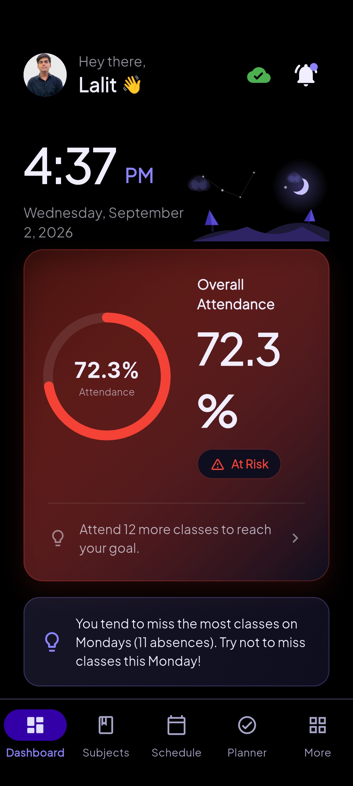
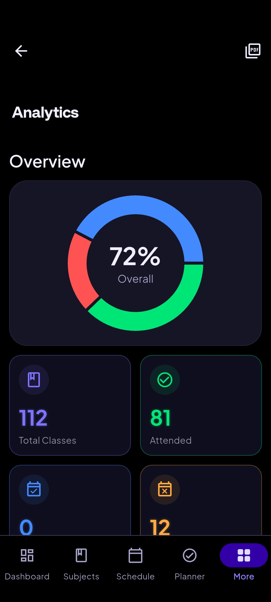
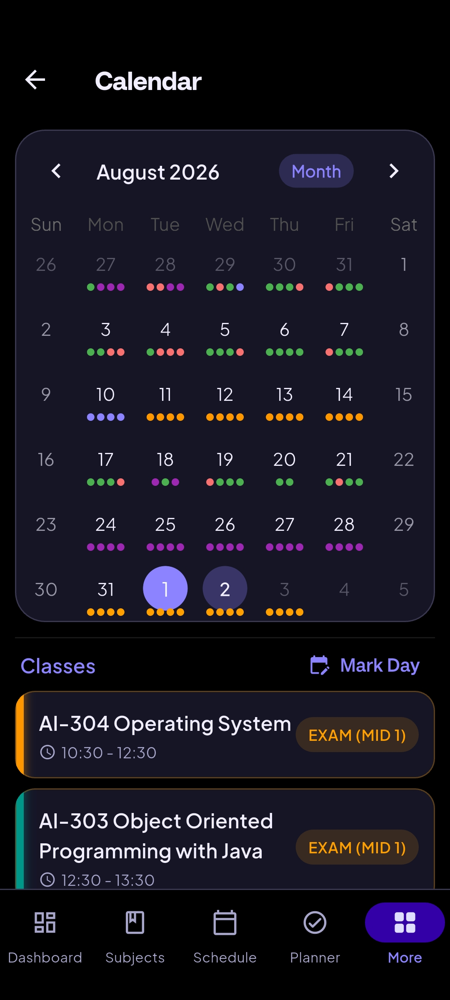

<div align="center">

# 🎓 AttendifyX

**Smart Attendance Tracker & Academic Companion for College Students**

[](https://github.com/Lalitjindal-code/AttendanceX/actions/workflows/ci.yml)
[](https://flutter.dev/)
[](https://dart.dev/)
[](https://github.com/Lalitjindal-code/AttendanceX/releases/tag/v1.1.0-beta.3)
[](https://opensource.org/licenses/MIT)

AttendifyX is a production-grade, offline-first Flutter application built for college students to track attendance with high precision, safe bunk predictions, exam day marking, and a buttery-smooth Material 3 user interface.

[🌐 View Landing Page](landing/index.html) · [⬇ Download Latest APK](https://github.com/Lalitjindal-code/AttendanceX/releases/download/v1.1.0-beta.3/app-release.apk)

</div>

---

<div align="center">
  
  
  
  
</div>

---

## 🚀 Key Features

* 📊 **Smart Dashboard**: Real-time view of today's schedule with a clean split between upcoming ("Pending") and marked classes, live attendance percentage ring, and quick action cards.
* 🎯 **Safe Bunk & Attendance Prediction Engine**:
  * Powered by `AttendanceEngine`, dynamically calculates exact safe bunks available and minimum classes required to maintain target percentage (e.g., 75%).
  * Simulates future attendance scenarios with an interactive Bunk Simulator.
* 📝 **Exam Day Marking**: Easily mark Mid Sem 1, Mid Sem 2, End Sem, and Practical Exam days. Exam days are intelligently excluded from regular attendance calculations automatically.
* 🔄 **In-App Update Engine**: Powered by Firebase Remote Config and GitHub Releases, notifying users of new updates instantly with one-tap APK downloading and installation.
* ⚡ **100% Offline-First & Private**: Built on top of **Isar NoSQL** database — zero internet required, sub-100ms response times, and 100% private with no mandatory login.
* 📅 **Calendar & Timetable Auto-Generation**: Set up your weekly schedule once and let AttendifyX populate your daily dashboard automatically. View full attendance history on a color-coded calendar.
* ⏰ **Smart Notifications & Daily Backups**: Timely class reminders, low attendance alerts, goal celebrations, and automated local data backups.
* 🌐 **Modern Landing Page**: Built-in dark glassmorphism web landing page in `/landing` ready for static deployment.

---

## 🛠 Tech Stack

| Technology | Purpose / Usage |
|---|---|
| **Flutter (Dart 3.3+)** | Cross-platform UI Framework (Material 3) |
| **Riverpod** | State Management (`flutter_riverpod` + `riverpod_annotation`) |
| **Isar NoSQL** | Blazing fast, offline-first local database |
| **Firebase** | Remote Config (In-App Updates) & Cloud Services |
| **GoRouter** | Declarative type-safe routing |
| **GitHub Actions** | Automated CI/CD pipeline for linting, unit testing, and builds |

---

## 📂 Architecture Overview

AttendifyX follows a modular, layer-based architecture enforcing clean separation of concerns:

```
lib/
├── core/            # Enums, Extensions, Theme, Common UI Widgets, App Updater
├── database/        # Isar Collections (Subject, Schedule, Attendance, History) & Repositories
├── engines/         # Decoupled business logic (AttendanceEngine, NotificationEngine)
├── features/        # Feature modules (dashboard, analytics, calendar, subjects, schedule, etc.)
│   ├── analytics/   # Analytics calculations, providers, and screen
│   ├── calendar/    # Calendar grid, day details, exam marking
│   ├── dashboard/   # Header, class list cards, summary state
│   ├── schedule/    # Weekly timetable setup & OCR import
│   └── settings/    # App settings, preferences, feedback service
├── navigation/      # GoRouter routes and shell scaffold
└── services/        # UpdateService, BackupRestoreService, PreferencesService
```

---

## 🚀 Getting Started

### Prerequisites
* [Flutter SDK](https://flutter.dev/docs/get-started/install) (v3.19 or higher)
* Dart SDK (v3.3 or higher)
* Android Studio / VS Code

### Setup & Installation

1. **Clone the Repository**
   ```bash
   git clone https://github.com/Lalitjindal-code/AttendanceX.git
   cd AttendanceX
   ```

2. **Install Dependencies**
   ```bash
   flutter pub get
   ```

3. **Generate Code (Isar & Riverpod)**
   ```bash
   dart run build_runner build --delete-conflicting-outputs
   ```

4. **Run the Application**
   ```bash
   flutter run
   ```

---

## 🧪 Testing

The project is backed by **89+ unit and widget tests** covering the calculation engine, repository data flows, and notification scheduling.

```bash
# Run unit and widget tests
flutter test
```

---

## 📄 License

This project is licensed under the MIT License — see the [LICENSE](LICENSE) file for details.

---

<div align="center">
  <i>Built with ❤️ by Lalit Jindal</i>
</div>

