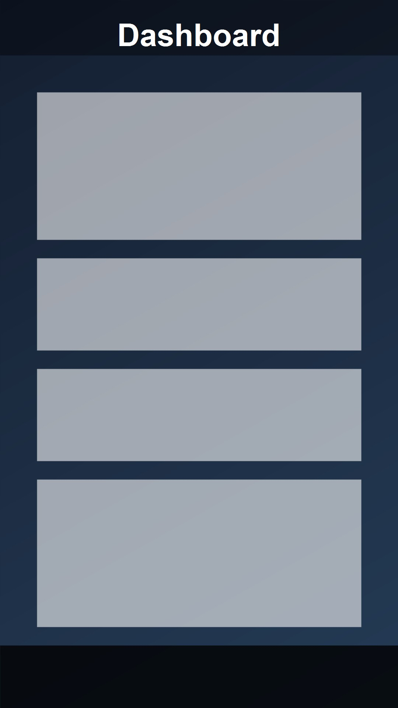
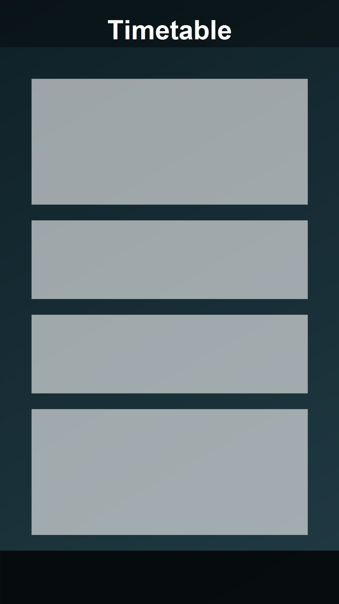
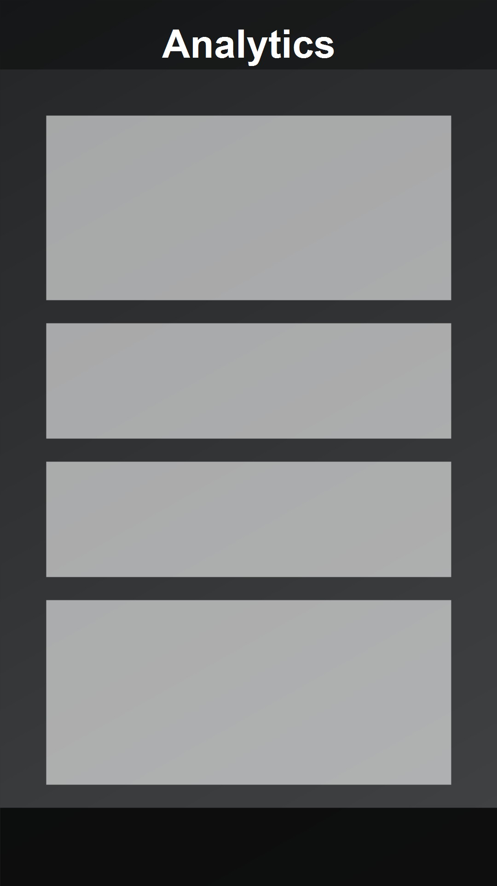

<div align="center">

# 🎓 Attendify

**Your Ultimate Academic Companion**

[](https://github.com/Lalitjindal-code/Attendify/actions/workflows/ci.yml)
[](https://flutter.dev/)
[](https://dart.dev/)
[](https://opensource.org/licenses/MIT)

Attendify is a production-grade, offline-first Flutter application designed for students to track their academic attendance with precision, smart analytics, and a buttery-smooth user interface. 

</div>

---

<div align="center">
  
  
  
</div>

---

## 🚀 Key Features

* 📊 **Smart Dashboard**: A beautifully animated dashboard that cleanly separates your upcoming classes ("Pending") from the ones you've already completed ("Marked").
* 🎯 **Granular Attendance Tracking**: Track attendance with high specificity—*Present*, *Absent*, *GT (Duty Leave)*, *Medical Leave*, and *Holidays*.
* 🧠 **Analytics & Smart Suggestions**: 
  * Powered by a robust `AttendanceEngine`, the app dynamically calculates effective percentages based on your custom rules (e.g., whether Medical Leaves count as present).
  * Provides actionable insights like **"Safe Bunks Available"** or **"Classes to Attend"** to help you hit your target goal without stress.
* ⚡ **Offline-First & Lightning Fast**: Built on top of **Isar NoSQL**, ensuring that all data operations are instantaneous and completely functional without an internet connection. 
* ⚙️ **Highly Customisable**: Set your target percentage (e.g., 75%), adjust semester dates, and toggle specific attendance calculation rules to fit your college's guidelines.
* 🎨 **Beautiful UI/UX**: Built with implicit animations, smooth transitions, haptic feedback, and a strictly enforced Material 3 design system.

---

## 🛠 Tech Stack

| Technology | Description |
|---|---|
| **Flutter (Dart)** | Core UI Framework |
| **Riverpod** | State Management (`flutter_riverpod` + `riverpod_annotation`) |
| **Isar NoSQL** | Blazing fast, offline-first local database |
| **Firebase** | Backend services for Authentication & Cloud Firestore sync |
| **GitHub Actions** | Automated CI/CD pipelines for linting and testing |

---

## 📂 Architecture Overview

Attendify follows a highly structured, scalable, layer-based architecture that cleanly separates business logic from presentation:

* 🗄️ **`/database`**: Contains Isar collections (`Subject`, `Schedule`, `Attendance`) and data Repositories.
* ⚙️ **`/engines`**: Core business logic modules (e.g. `AttendanceEngine`) that are completely decoupled from UI and State Management. These are highly testable, pure Dart classes.
* 📱 **`/features`**: UI code separated by domain (e.g., `dashboard`, `analytics`, `calendar`, `settings`, `subjects`, `schedule`), each containing its own screens, widgets, and local Riverpod providers.
* 🔧 **`/core`**: Core utilities, app-wide Enums, Theme data, custom extensions (e.g., `AttendanceStatusUI`), and global configuration.

---

## 🚀 Getting Started

### Prerequisites
* [Flutter SDK](https://flutter.dev/docs/get-started/install) (v3.19 or higher)
* Dart SDK

### Installation

1. **Clone the repository**
   ```bash
   git clone https://github.com/Lalitjindal-code/Attendify.git
   cd Attendify
   ```

2. **Install dependencies**
   ```bash
   flutter pub get
   ```

3. **Generate Isar & Riverpod files**  
   *(Required if you modify models or providers)*
   ```bash
   dart run build_runner build --delete-conflicting-outputs
   ```

4. **Run the App**
   ```bash
   flutter run
   ```

---

## 📝 Testing

The project includes comprehensive Unit Tests and Widget Tests (including Golden tests using `golden_toolkit` to ensure pixel-perfect UI). Run the test suite using:

```bash
flutter test
```

---

## ✨ Recent Updates
* 🔒 **Settings Revamp**: Simplified settings page, removed legacy features, and added Privacy Policy.
* 🤖 **GitHub Actions CI/CD**: Added automated workflow for linting, testing, and building Android/iOS apps.
* ☁️ **Firebase Integration**: Added Firebase Auth and Cloud Firestore dependencies for seamless cloud sync.
* 📈 **Dashboard Overhaul**: Seamlessly split Pending vs Marked classes with dynamic progress rings, clean badges, and reusable BottomSheets.
* 📅 **Date Sync Fixes**: Improved time-zone resilient UTC/Local `DateTime` comparisons for robust daily tracking.

---

<div align="center">
  <i>Built with ❤️ by Lalit Jindal</i>
</div>
